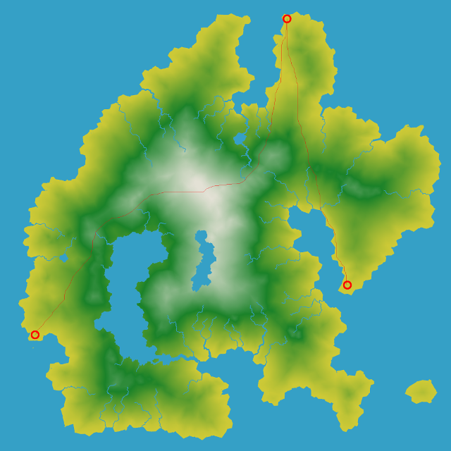

# Bachelor Project

Jun Zhu

---

## Introduction

"Imagine you’re waking up on the beach of an island. You have no idea where you are. Oh, but wait, now you remember. It’s your wedding day. And you had a terrible bachelors party. You need to get to the wedding like yesterday… You find a remote control to your Audi Rover (tm) in your pocket by which you can summon your rover to your location, and then take you in the shortest possible time to the actual wedding.
 
Your task is to find the fastest route you can by which the rover (located at ROVER_X, ROVER_Y on the map) is summoned to your location (BACHELOR_X, BACHELOR_Y), and sent to the wedding (WEDDING_X, WEDDING_Y), subject to some constraints. You are to visualize the taken path using the BMP file writer included with the file package. You will need to provide the consumed time for the path and also explain the model choices below.
 
Some definitions:
 
- There are 2 files available containing elevation (0-255) over the ground (elevation.data) and terrain flag bitmasks (overrides.data). 
- Here is some useful information about the bitmap values:
  1. Rivers and marsh has bit 4 set
  2. Water basins have bit 6 set.
- These files contain 2048x2048 8-bit byte values with each row’s columns stored in consecutive order with no row padding.
 
Interesting left-top (x, y) coordinates
- The rover is located at 159, 1520.
- The bachelor is located at 1303, 85.
- The wedding is taking place at 1577, 1294.

## Dependencies

cmake >= 3.8

## Build and run

Make a build directory: mkdir build && cd build

Compile: cmake .. && make

Run it: ./Bachelor

## Motion model

- The rover’s normal speed is 1 cell per island second. For example if the rover’s going diagonally, the time consumption is sqrt(2). 
- The rover cannot swim, nor can it crawl marshes
- The rover’s speed is lower uphill. It’s part of the task to model in which way it becomes slower.
- The rover’s speed gets higher when running downhill. It’s part of the task to model in which way it becomes faster.
- **A simple model is used to describe the rover's time consumption when going uphill and downhill**
  
  uphill_time_consumption = normal_time_consumption*(1 + elevation_difference/10)
  
  downhill_time_consumption = normal_time_consumption*(1 - elevation_difference/21)
  
  Here 'elevation_difference' refers to the difference of elevation between two points. The maximum elevation difference between two adjacent reachable points is 8 in this map. Since the path length will increase no matter the rover goes uphill or downhill, the uphill time consumption is penalized more than the downhill time consumptin is awarded. The model concludes that the time consumption of one uphill point plus two downhill points is slightly longer than that of three flat points. Therefore, in most cases, the rover will choose flat terrain. 

## Search model

A* search algorithm is implemented.

## Result

The time consumption from the rover to the bachelor is 2220.57 island seconds.

The time consumption from the bachelor to the wedding is 1345.98 island seconds.

